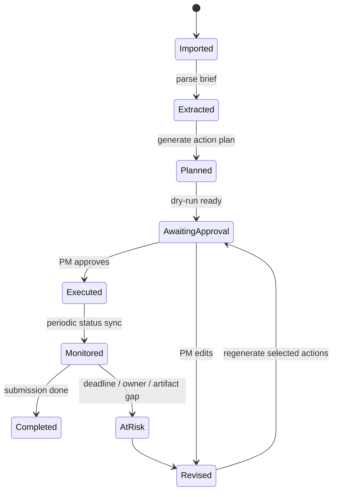

# 02 — Specification

## Domain Model

### CompetitionBrief

代表一場競賽的結構化資料。

欄位：
- `competition_id`
- `name`
- `organizer`
- `source_uri`
- `submission_deadline`
- `final_event_date`
- `eligibility`
- `deliverables`
- `scoring_rubric`
- `anonymous_rules`
- `language_requirements`
- `risk_flags`

### Deliverable

代表應繳資料。

欄位：
- `title`
- `description`
- `format`
- `page_limit`
- `duration_limit_seconds`
- `language`
- `deadline`
- `owner_role`

### TaskDraft

代表尚未寫入 Kanban 的任務草稿。

欄位：
- `title`
- `description`
- `priority`
- `owner_role`
- `suggested_assignee`
- `due_date`
- `source_requirement`
- `acceptance_criteria`

### CalendarEventDraft

代表尚未寫入 Google Calendar 的事件草稿。

欄位：
- `title`
- `start`
- `end`
- `description`
- `attendees`
- `requires_approval`

### ActionPlan

代表 AI 要執行的外部操作計畫。

欄位：
- `plan_id`
- `competition_id`
- `dry_run`
- `actions`
- `risk_level`
- `requires_approval`

## Use Case 1 — Ingest Competition Brief

Given PM uploads or references a competition brief  
When the system extracts requirements  
Then it returns structured `CompetitionBrief`  
And no external write action is executed by default.

Acceptance criteria:
- PDF / text / URL ingestion interface exists.
- Extraction result validates against Pydantic schema.
- Missing deadlines are marked as `risk_flags`.
- The result includes source trace fields where possible.

## Use Case 2 — Generate PM Action Plan

Given a valid CompetitionBrief and team capacity table  
When PM asks for a competition action plan  
Then the system generates:
- task drafts
- docs draft outline
- sheets update draft
- calendar event drafts
- Kanban issue drafts

Acceptance criteria:
- Each task maps to at least one deliverable or rubric item.
- Each deadline is no later than competition deadline.
- Each high-risk action sets `requires_approval=true`.
- The system returns `dry_run=true` by default.

## Use Case 3 — Approve and Execute Write Actions

Given a dry-run ActionPlan  
When PM approves selected actions  
Then adapters execute only approved actions.

Acceptance criteria:
- Unapproved actions are not executed.
- Each executed action writes audit log.
- Failures are isolated per action.
- Re-running an idempotent action does not duplicate folders/docs/events/tasks when stable external IDs exist.

## Use Case 4 — Create Google Workspace Artifacts

Artifacts:
- Drive competition folder
- Docs proposal outline
- Sheets tracking rows
- Calendar checkpoint events

Acceptance criteria:
- Google writes are implemented through adapter interfaces.
- Real adapter is optional in MVP; mock adapter must pass tests.
- Low-level destructive operations are not exposed through MCP.

## Use Case 5 — Sync Plane Tasks

Given task drafts  
When PM approves task creation  
Then Plane issues are created or updated.

Acceptance criteria:
- Plane adapter accepts TaskDraft.
- Plane API failure does not break Google writes.
- Each created task stores external URL / ID in audit log.

## State Machine

