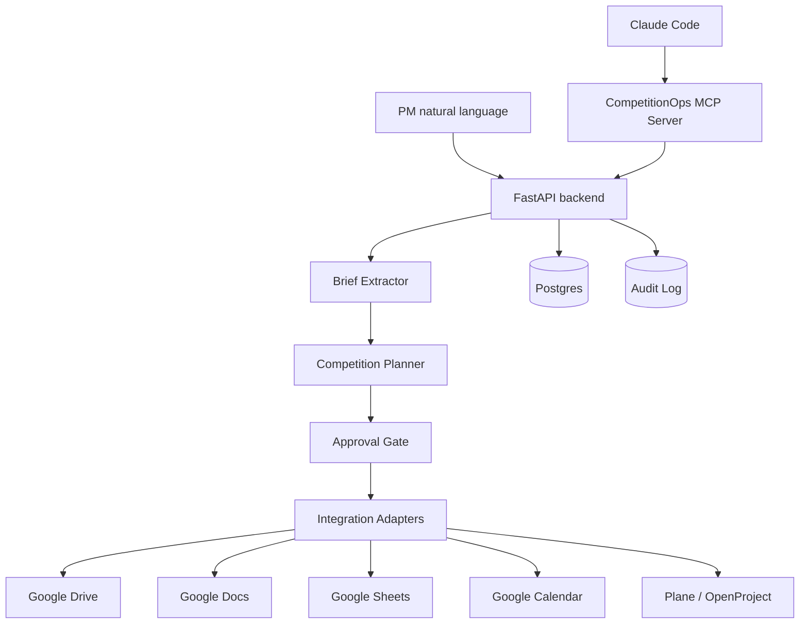

# 03 — Architecture

## High-level Architecture



## Layers

### Domain

- Pydantic models
- Business rules
- Risk classification
- Action plan generation

### Application

- Ingestion workflow
- Planning workflow
- Approval workflow
- Execution workflow

### Infrastructure

- Google API adapters
- Plane adapter
- Postgres repository
- Audit logging
- MCP server

## Recommended Production Topology

```text
Local laptop / workstation
  - Claude Code
  - CompetitionOps repo
  - local MCP server
  - uv / pytest / docker

Self-hosted dev stack
  - FastAPI
  - Postgres
  - Windmill
  - Plane
  - optional MinIO
  - optional local LLM / GPU workers

Google account
  - Drive
  - Docs
  - Sheets
  - Calendar
```

## GPU / K8s Use

GPU 不需要用在 MVP 的 Google automation 本身。GPU/k8s 資源可用於：

1. 本地文件解析 OCR / layout model。
2. 大量競賽資料的 embedding / retrieval。
3. 自架 LLM / reranker。
4. CI runner 或 ephemeral dev environment。
5. K8s 部署 staging environment。

## Adapter Pattern

所有外部工具都要實作 port：

```python
class CalendarPort(Protocol):
    async def create_event(self, draft: CalendarEventDraft, dry_run: bool) -> ExternalActionResult: ...
```

MVP 先寫 fake adapter，再寫 real adapter。
