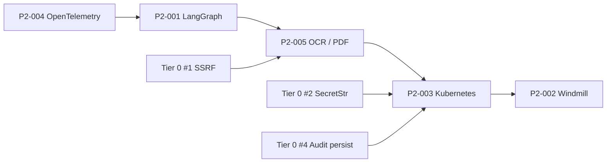
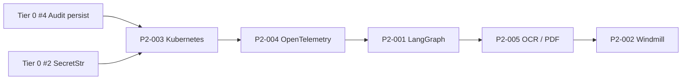

# 10 — P2 TDD Roadmap

日期基準：2026-05-13。

## 這份文件的角色

| 文件 | 內容 | 何時更新 |
|---|---|---|
| `07_backlog.md` | Backlog ID 表（P0/P1/P2-XXX 名稱、acceptance criteria、status） | 開卡、結卡 |
| **`10_p2_roadmap.md`（本文）** | P2 各項的 **TDD step-by-step**：sprint 序、test 函式名、source touchpoint、驗證指令、DoD checklist | 每個 sprint 開工前 / 完工後 |

兩者並列：`07` 是「做什麼」，`10` 是「怎麼做」。當 `10` 的 sprint 全部 ✅ 並通過 `bash scripts/verify.sh`，把對應的 `07` ID 標為 Done。

## 目錄

- [進度總覽](#進度總覽)
- [推進順序](#推進順序)
- [跨項目前置：Tier 0 from blocker checklist](#跨項目前置tier-0-from-blocker-checklist)
- [P2-004 — OpenTelemetry Observability](#p2-004--opentelemetry-observability)
- [P2-001 — LangGraph workflow with human-in-the-loop](#p2-001--langgraph-workflow-with-human-in-the-loop)
- [P2-005 — Local OCR / layout parsing](#p2-005--local-ocr--layout-parsing)
- [P2-003 — Kubernetes Deployment](#p2-003--kubernetes-deployment)
- [P2-002 — Windmill workflow scripts](#p2-002--windmill-workflow-scripts)
- [Sprint 0 — 下一個 30 分鐘的具體動作](#sprint-0--下一個-30-分鐘的具體動作)
- [跨參考](#跨參考)

---

## 進度總覽

| ID | 主題 | Sprints | 估時（solo full-time） | 依賴 | 狀態 |
|---|---|---:|---|---|---|
| Tier 0 #1 | SSRF allow-list | 2 | 0.5 d | — | ✅ Done (2026-05-14, source_uri_validator) |
| Tier 0 #2 | SecretStr for OAuth keys | 2 | 0.5 d | — | ✅ Done (2026-05-14, commit pending) |
| Tier 0 #3 | Plane real adapter + external_id | 4 | 2 d | — | ✅ Done (2026-05-14, P1-004) |
| Tier 0 #4 | Audit log 落地（File / sqlite） | 4 | 2 d | — | ✅ Done (2026-05-14, FileAuditLog) |
| Tier 0 #5 | Real adapter query-then-create | 6 | 3 d | Tier 0 #2 | ✅ Done (2026-05-14, Plane; pattern available for P1-001~003) |
| **P2-004** | OpenTelemetry observability | 6 | 3–5 d | — | 待辦 |
| **P2-001** | LangGraph workflow + interrupt | 6 | 5–7 d | P2-004（建議） | ✅ Done (2026-05-14, 11 tests) |
| **P2-005** | OCR / PDF ingestion | 5 (+1 GPU) | 5–7 d | Tier 0 #1（drive 路徑） | 待辦 |
| **P2-003** | Kubernetes deployment | 6 | 5–10 d | Tier 0 #2 + #4 | 待辦 |
| **P2-002** | Windmill workflow scripts | 4 | 2–3 d | — | ✅ Done (2026-05-14, 8 tests) |

合計：27 sprints / 約 3–5 週 solo full-time / 約 6 個月 solo 1 天每週。

---

## 推進順序

### A. Dev-first（推薦預設）

理由：對單人 / 小團隊，OTel 帶來的回饋最快，K8s ROI 在沒 staging team 之前不高。



### B. Prod-first（替代）

理由：若已有 staging team 等著上線，先把 K8s + 持久化補齊。



---

## 跨項目前置：Tier 0 from blocker checklist

來自 `docs/08_api_contracts.md` 與 Stage 7 security review 的 Tier 0 必修項，其中 **#2 與 #4 是 K8s 的硬前置**：

| Tier 0 # | 內容 | 阻擋哪個 P2 | 摘要修法 |
|---|---|---|---|
| #1 | SSRF allow-list on `BriefExtractRequest.source_type` | P2-005（drive/url 路徑） | Pydantic validator + scheme/host allowlist |
| #2 | `SecretStr` for OAuth/API keys | P2-003（Secret 安全注入） | `pydantic.SecretStr` 改型別 + repr 遮罩測試 |
| #3 | Plane real adapter 補 `external_id` | P2-001（audit assertion 完整性） | 升級 stub 成 stateful mock + real adapter |
| #4 | Audit log 落地（FileAuditLog / sqlite） | P2-003（PVC mount 才有意義） | append-only `~/.competitionops/audit/<plan_id>.jsonl` 或 sqlite via `Settings.database_url` |
| #5 | Real adapter query-then-create | P2-001（resume 後不重建） | Drive/Calendar 先 list/search 再 create |

---

## P2-004 — OpenTelemetry Observability

### 目標
把 ExecutionService / FastAPI / MCP server 接 OTel，可用 OTLP exporter 把 trace + metric 推到 Grafana LGTM stack 或任何 OTLP-compatible backend。

### 前置條件
- ✅ 既有 `ExecutionService / main.py / MCP server`
- ⚠️ `pyproject.toml` 加 `[project.optional-dependencies.otel]`（本 sprint 開工時加）

### 套件與環境
```toml
[project.optional-dependencies]
otel = [
    "opentelemetry-api>=1.27.0",
    "opentelemetry-sdk>=1.27.0",
    "opentelemetry-instrumentation-fastapi>=0.48b0",
    "opentelemetry-exporter-otlp>=1.27.0",
]
```
安裝：`uv sync --extra otel`

### TDD Sprint 序列

| Sprint | 動作 | 紅→綠測試 | source touchpoint |
|---:|---|---|---|
| 0 | bootstrap setup 模組 | `tests/test_telemetry_setup.py::test_setup_creates_tracer_provider` — 斷言 `competitionops.telemetry.setup_tracer_provider()` 回 TracerProvider 並註冊到 `trace.get_tracer_provider()` | `src/competitionops/telemetry/__init__.py`、`telemetry/setup.py`（新） |
| 1 | idempotency | `test_setup_idempotent` — 兩次呼叫不重複裝 | `setup.py` 用 `lru_cache` |
| 2 | ExecutionService 手動 span | `tests/test_execution_telemetry.py::test_approve_and_execute_emits_spans` — `InMemorySpanExporter` 收 1 root + N child | `services/execution.py` 加 `tracer.start_as_current_span(...)` |
| 3 | span attribute 對齊 spec | `test_span_attributes_match_spec` — 5 個 attr：`plan_id / action_id / target_system / risk_level / event_status` | 同上 |
| 4 | FastAPI 自動 instrument | `tests/test_fastapi_telemetry.py::test_http_request_creates_server_span` — TestClient.post 後有 1 個 `http.server` span，`http.route` 對齊 | `main.py` 加 `FastAPIInstrumentor.instrument_app(app)` |
| 5 | Metrics counter | `tests/test_metrics.py::test_action_counter_increments_per_state` — `counter("competitionops.actions.total")` 標 `state=approved/executed/blocked/...` | `telemetry/metrics.py`（新） |
| 6 | （optional）Console exporter dev mode | env `COMPETITIONOPS_OTEL_EXPORTER=console` 切 console exporter | `telemetry/setup.py` 讀 env |

### 驗證指令
```bash
uv sync --extra otel
uv run pytest tests/test_telemetry_setup.py tests/test_execution_telemetry.py tests/test_fastapi_telemetry.py tests/test_metrics.py -vv
bash scripts/verify.sh   # 既有 62 + 新 OTel 測試全綠
```

### Definition of Done

- [ ] `ExecutionService.approve_actions / approve_single_action / run_approved` 各 1 root span + N child span
- [ ] 每個 adapter call 1 client span
- [ ] FastAPI 所有 endpoint 自動 instrument
- [ ] MCP tool（async path）手動 instrument
- [ ] Counter / histogram 至少有：`action_status_total`、`action_execution_duration_seconds`、`audit_records_total`
- [ ] InMemorySpanExporter fixture 在測試之間自動 reset，不污染 global TracerProvider
- [ ] `bash scripts/verify.sh` 全綠

### 風險

| 風險 | 緩解 |
|---|---|
| OTel SDK / instrumentation 版本對齊 | pin caret（`1.27.*` / `0.48b0`） |
| Global TracerProvider 污染測試 | `pytest` autouse fixture reset to `NoOpTracerProvider` |
| Adapter call 每筆 span 的開銷 | benchmark：62 個現有測試 wall-clock < 1.5s 不退化 |

---

## P2-001 — LangGraph workflow with human-in-the-loop

### 目標
把目前散落在 4 個 HTTP endpoint 的 brief→plan→approve→execute 流程，包進一個 LangGraph state graph，approval 節點為 **interrupt**（PM 不批就停留）。

### 前置條件
- ✅ ExecutionService / Planner / BriefExtractor / MCP server
- ✅ `pyproject.toml.[project.optional-dependencies.langgraph]` 已存在（需 bump 到 ≥0.5）
- 🔁 **建議先做 P2-004 OTel**，這樣 LangGraph 的每個 node 自動被 instrument

### 套件與環境
```toml
langgraph = [
    "langgraph>=0.5.0",
    "langgraph-checkpoint>=2.0.0",
]
```
安裝：`uv sync --extra langgraph`

### TDD Sprint 序列

| Sprint | 動作 | 紅→綠測試 | source touchpoint |
|---:|---|---|---|
| 0 | State schema | `tests/test_workflow_state.py::test_state_schema_round_trip` — `CompetitionOpsState(brief=..., plan=..., approvals=[], executed_results=[])` 可序列化 | `src/competitionops/workflows/__init__.py`、`workflows/state.py` |
| 1 | `extract_node` | `test_workflow_nodes.py::test_extract_node_populates_brief` mock raw text → state.brief 非空 | `workflows/nodes.py` |
| 2 | `plan_node` | `test_plan_node_calls_planner` — state.plan 非空、actions ≥ 3 | 同上 |
| 3 | `approve_node` **interrupt** | `test_graph_interrupts_before_approval` — graph 跑到此節點時 `graph.get_state()` 顯示 `next=["approve_node"]`、**任何 adapter 0 call** | `workflows/graph.py` 加 `interrupt_before=["approve"]` |
| 4 | `execute_node` + `audit_node` | `test_graph_resume_after_approval` — 從 checkpoint 恢復 + 餵 `approved_action_ids` + state.executed_results 對齊 | 同上 |
| 5 | MemorySaver checkpointer | `test_graph_checkpoint_persists_across_invocations` — kill + new app instance + resume from `thread_id` | `workflows/graph.py` 注入 `MemorySaver()` |
| 6 | （optional）HTTP endpoint | `POST /workflows/start` / `POST /workflows/{thread_id}/resume` / `GET /workflows/{thread_id}/state` | `main.py` |

### 驗證指令
```bash
uv sync --extra langgraph
uv run pytest tests/test_workflow_state.py tests/test_workflow_nodes.py tests/test_workflow_graph.py -vv
bash scripts/verify.sh
```

### Definition of Done

- [ ] LangGraph compiles without warning
- [ ] Interrupt 在 approve 之前生效（adapter 0 call）
- [ ] Resume from checkpoint 後 adapter 才開始 call
- [ ] LangGraph node 內部呼叫 ExecutionService，**不**另存一份 plan state（避免雙寫不一致）
- [ ] 既有 4 個 HTTP endpoint 不動（兩個層級共存）
- [ ] 完整 happy path + interrupt + dangerous 注入 3 條測試

### 風險

| 風險 | 緩解 |
|---|---|
| LangGraph 0.5 → 1.0 API 斷裂 | pin `0.5.*`，升級時走獨立 PR |
| State 雙寫一致性（LangGraph state vs InMemoryPlanRepository） | LangGraph node 永遠呼叫 ExecutionService 為單一真實來源，不自己存 plan |
| Checkpointer 在 prod 持久化 | 從 MemorySaver 升 SqliteSaver / PostgresSaver 時走獨立 PR |

---

## P2-005 — Local OCR / layout parsing

### 目標
讓 `POST /briefs/extract` 接受 `source_type="pdf"`（multipart upload）或 `source_type="drive"`（先讀後 OCR），透過 `PdfIngestionPort` 把 PDF → text，再交給 `BriefExtractor`。GPU 路徑為可選加強。

### 前置條件
- ✅ BriefExtractor
- ⚠️ **Tier 0 #1 SSRF allow-list 必須先做** — 否則 `source_type="url"` 不能開
- ✅ Stage 8 Path A 已示範 PM augment owner_role 流程，OCR 路徑不變

### 套件與環境
```toml
ocr = [
    "docling>=2.0.0",
    "pypdf>=4.0.0",
]
ocr-gpu = [
    "docling[gpu]>=2.0.0",
    "torch>=2.4.0",
]
```
CPU：`uv sync --extra ocr`；GPU：`uv sync --extra ocr-gpu`（需 CUDA 12+）。

### TDD Sprint 序列

| Sprint | 動作 | 紅→綠測試 | source touchpoint |
|---:|---|---|---|
| 0 | Port + mock | `tests/test_pdf_ingestion.py::test_mock_returns_brief_text` — `MockPdfAdapter().extract(b"%PDF...")` 回 text | `ports.py` 加 `PdfIngestionPort`、`adapters/pdf_mock.py`、`tests/fixtures/sample_runspace.pdf` (≤50KB 自製合成) |
| 1 | 串到 BriefExtractor | `test_brief_extractor_accepts_pdf_source` — 餵 PdfIngestionPort + raw bytes，回 `CompetitionBrief` 帶 `source_uri="pdf://<sha1>"` | `brief_extractor.py` 構造子接 ingestion port |
| 2 | 串到 HTTP endpoint | `test_api_briefs_pdf_upload` — POST `/briefs/extract` multipart + `source_type=pdf` 回 200 | `main.py` multipart handler、`schemas.BriefExtractRequest.source_type: Literal["text","pdf"]` |
| 3 | Docling real adapter | `test_docling_adapter_extracts_runspace_pdf`（mark `@pytest.mark.slow`） | `adapters/pdf_docling.py` |
| 4 | （optional）GPU 路徑 | `test_docling_gpu_adapter_uses_cuda`（mark `@pytest.mark.gpu`，CI skip 若無 CUDA） | 同上 |
| 5 | Drive 路徑（依賴 P1 real Drive adapter + Tier 0 #1） | `test_extract_from_drive_url_after_oauth_mock` — mock GoogleDriveAdapter download | Drive real adapter 必須先有 |

### 驗證指令
```bash
uv sync --extra ocr
uv run pytest tests/test_pdf_ingestion.py tests/test_brief_extractor.py -m "not slow and not gpu" -vv
# nightly:
uv run pytest -m slow -vv
```

### Definition of Done

- [ ] `source_type="pdf"` 透過 multipart upload 可用
- [ ] PDF size limit（10MB）+ 副檔名 / magic bytes 雙重驗證
- [ ] PDF page limit ≤ 100 防 zip-bomb
- [ ] OCR 階段失敗回 `422` 並帶 `risk_flag: "ocr_extraction_failed"` 進 CompetitionBrief
- [ ] GPU 路徑為可選 `--extra`，CPU 路徑為預設
- [ ] Fixture PDF 為自製合成簡章，無 copyright 爭議
- [ ] `bash scripts/verify.sh` 全綠（slow / gpu 標籤排除）

### 風險

| 風險 | 緩解 |
|---|---|
| Docling 依賴 PyTorch 體積龐大 | 隔離為 `--extra ocr` optional dep；不裝就用 pypdf fallback |
| PDF bomb / 解壓炸彈 | 大小 + page count 雙重 limit |
| 真實 PDF copyright / 隱私 | 測試 fixture 必須自製 |
| OCR 對手寫品質差 | MVP 不處理手寫，risk_flag 標記 |

---

## P2-003 — Kubernetes Deployment

### 目標
給 staging / prod 環境用的 kustomize-based manifests，含 PVC（audit）、Secret（OAuth）、ConfigMap（env）、Ingress（TLS）。

### 前置條件
- 🚫 **Tier 0 #4 audit log 落地必須先做** — 沒持久化就沒必要 PVC
- 🚫 **Tier 0 #2 SecretStr 必須先做** — K8s Secret 才能安全注入
- ✅ `infra/k8s/` 既有 minimal 三檔 — 會被 kustomize base 取代

### 套件與環境
- 本機需要 `kustomize`、`kubectl`、`kind`（或 minikube）做測試
- CI：GitHub Action runner 自帶 kustomize

### TDD Sprint 序列

| Sprint | 動作 | 紅→綠測試 | infra/ touchpoint |
|---:|---|---|---|
| 0 | kustomize base 骨架 | `tests/test_k8s_manifests.py::test_kustomize_base_builds` — `subprocess.run(["kustomize", "build", "infra/k8s/base"])` 退出碼 0 | `infra/k8s/base/kustomization.yaml`（新） |
| 1 | base manifests | `test_deployment_uses_distroless_image`、`test_pod_runs_as_nonroot`、`test_pod_has_readinessprobe_on_health` | `infra/k8s/base/{deployment,service,configmap,namespace}.yaml` |
| 2 | PVC for audit log | `test_pvc_for_audit_log_present` + `test_deployment_mounts_audit_pvc_at_var_lib_audit` | `infra/k8s/base/pvc.yaml` |
| 3 | Secret 範本（不 commit 真實值） | `test_secret_template_has_all_required_keys` — 檢查 5 個 key（OAuth client_id/secret、PLANE_API_KEY、ANTHROPIC_API_KEY、SESSION_SECRET）存在但 value 為空 | `infra/k8s/base/secret.template.yaml` |
| 4 | dev/staging/prod overlay | `test_overlay_dev_uses_emptydir_for_audit`、`test_overlay_prod_uses_pvc_for_audit` | `infra/k8s/overlays/{dev,staging,prod}/` |
| 5 | Ingress + cert-manager | `test_ingress_has_tls_section`、`test_ingress_routes_to_service` | `infra/k8s/overlays/{staging,prod}/ingress.yaml` |
| 6 | （optional）kind smoke | `test_pod_starts_in_kind_cluster`（mark `@pytest.mark.k8s_smoke`） | `scripts/k8s_smoke.sh` |

### 驗證指令
```bash
# unit (kustomize build only)
uv run pytest tests/test_k8s_manifests.py -vv

# smoke (needs kind cluster)
kind create cluster --name competitionops-test
uv run pytest -m k8s_smoke -vv
kind delete cluster --name competitionops-test

bash scripts/verify.sh
```

### Definition of Done

- [ ] `kustomize build infra/k8s/overlays/dev` 0 warning
- [ ] Pod 以 nonroot user 跑（USER 65532 distroless）
- [ ] readinessProbe 打 `/health`，livenessProbe 打 `/healthz`
- [ ] audit log 寫進 PVC（prod overlay）；emptyDir（dev overlay）
- [ ] Secret manifest **template only**，真實 secret 從 external Secrets Manager 注入（`external-secrets.io` 或 Vault Agent）
- [ ] **不做** Helm chart（避免雙工具鏈；kustomize 足夠）
- [ ] `infra/docker/Dockerfile` 從 `python:3.11-slim` 切到 distroless 多階段 build

### 風險

| 風險 | 緩解 |
|---|---|
| 多 replica 下 audit PVC 需 RWX storage class | dev 用 emptyDir；prod 強制 RWX（NFS / Filestore / EFS） |
| Secret rotation 後 pod 不自動 reload | 加 reloader sidecar 或 external-secrets refresh interval |
| distroless 切換破壞 hot reload | dev 用獨立 Dockerfile.dev（保留 slim） |

---

## P2-002 — Windmill workflow scripts

### 目標
讓 PM 不必碰 Claude Code、不必跑 curl，直接在 Windmill UI 點按鈕跑「上傳簡章 → 看 plan → 批准 → 看結果」。

### 前置條件
- ✅ HTTP API
- ⚠️ 需要一個 self-hosted Windmill 實例（local docker compose 即可）

### 套件與環境
- Windmill 本身用 docker；scripts 只用 stdlib + httpx
- `pyproject.toml` 不加新 dep；Windmill 端會 pip install httpx
- 新增 `infra/docker/windmill.docker-compose.yml`

### TDD Sprint 序列

| Sprint | 動作 | 紅→綠測試 | touchpoint |
|---:|---|---|---|
| 0 | Script signature 設計 | `tests/test_windmill_scripts.py::test_extract_brief_script_validates_input` — mock httpx，斷言 script 對缺欄位 raise ValueError | `infra/windmill/scripts/extract_brief.py`（新） |
| 1 | 3 個 Python script | extract / generate_plan / approve_and_execute；每個都是純函式 `def main(...) -> dict`（Windmill 標準 entry） | `infra/windmill/scripts/{extract,generate,approve}.py` |
| 2 | 測試對 TestClient | `test_extract_brief_e2e_against_local_api` — 啟動 `TestClient(app)`，pump 進 script，回值對齊 | scripts 用 `WINDMILL_API_BASE` env 預設 `http://localhost:8000` |
| 3 | Flow definition YAML | `infra/windmill/flows/competition_pipeline.yaml` — DAG：extract → generate → human_input(approval) → approve → execute | `infra/windmill/flows/competition_pipeline.yaml` |
| 4 | （optional）integration smoke | `test_windmill_flow_in_docker_compose`（mark `@pytest.mark.windmill_smoke`） | `scripts/windmill_smoke.sh` |

### 驗證指令
```bash
uv run pytest tests/test_windmill_scripts.py -vv

# 手動 smoke（不在 CI）
docker compose -f infra/docker/windmill.docker-compose.yml up -d
# 開 http://localhost:8000，import scripts，跑一次 pipeline
```

### Definition of Done

- [ ] 3 個 script 各自 unit-tested against `TestClient(app)`
- [ ] Flow definition import 後 Windmill UI 顯示 4 個節點 + 1 個 human input
- [ ] README 一節說明「Windmill instance setup」流程
- [ ] **不做** Windmill API token 自動化注入（PM 手動貼）

### 風險

| 風險 | 緩解 |
|---|---|
| Windmill v1 → v2 API breakage | pin Windmill docker image tag |
| Script 內 hardcoded `localhost:8000` 在 container 內打不到主機 | 用 `host.docker.internal` 或專屬 docker network |
| Human input 節點等待時間 | Windmill 預設 7 天 timeout，足夠 PM 工作日批准 |

---

## Sprint 0 — 下一個 30 分鐘的具體動作

採 **A 路徑（Dev-first）**，下一步是 **P2-004 OTel Sprint 0**。

```bash
# 1. 加 dep
# 編輯 pyproject.toml，加入：
#   [project.optional-dependencies]
#   otel = [
#       "opentelemetry-api>=1.27.0",
#       "opentelemetry-sdk>=1.27.0",
#       "opentelemetry-instrumentation-fastapi>=0.48b0",
#       "opentelemetry-exporter-otlp>=1.27.0",
#   ]
uv sync --extra otel

# 2. 寫 RED 測試（必先紅）
# 新增 tests/test_telemetry_setup.py：
#   - test_setup_creates_tracer_provider
#   - test_setup_idempotent
uv run pytest tests/test_telemetry_setup.py -vv
# 預期：ImportError on competitionops.telemetry

# 3. 寫最小實作（GREEN）
#   src/competitionops/telemetry/__init__.py
#   src/competitionops/telemetry/setup.py
#       - setup_tracer_provider() 用 lru_cache
#       - register InMemorySpanExporter 給測試用

# 4. 重跑 — 預期 2 passed
uv run pytest tests/test_telemetry_setup.py -vv

# 5. verify 全綠
bash scripts/verify.sh
```

完成後再進 Sprint 1（idempotent），依此類推。

---

## 跨參考

| 資源 | 用途 |
|---|---|
| `docs/07_backlog.md` | Backlog ID + acceptance + status；本文 sprint 完成後同步更新 |
| `docs/02_spec.md` | Domain model + Use Cases；新功能不偏離 spec |
| `docs/05_security_oauth.md` | Tier 0 #1/#2 與 dangerous action 黑名單來源 |
| `docs/08_api_contracts.md` | Stage 7 blocker checklist Tier 0 / 1 / 2 完整列表 |
| `docs/06_agile_sdd_tdd_workflow.md` | TDD red→green→refactor 流程定義 |
| `CLAUDE.md` | 開發鐵則：dry-run / approval gate / 不 commit secrets / hexagonal |
| `scripts/verify.sh` | 每個 sprint 末必跑：pytest + ruff + mypy |

---

## 變更記錄

| 日期 | 動作 | 作者 |
|---|---|---|
| 2026-05-13 | 初版建立；P2-001 ~ P2-005 + Tier 0 cross-ref 完整 TDD step-by-step | Claude Code（Stage 8 後置） |
| 2026-05-14 | P2-004 Sprint 0+2+3+4+5 全綠；Tier 0 #2 SecretStr ✅ | Claude Code |
| 2026-05-14 | Tier 0 #4 FileAuditLog 落地；AUDIT_LOG_DIR env 切換；13 條新測試 | Claude Code |
| 2026-05-14 | Tier 0 #1 SSRF allow-list；BriefExtractRequest 擴 url/drive；41 條新測試；P1-006 ready | Claude Code |
| 2026-05-14 | P2-004 Sprint 6 OTLP exporter wiring；env opt-in；7 條測試 + 1 OTLP skip | Claude Code |
| 2026-05-14 | P1-004 Plane real adapter；mock-first + httpx real mode；14 條測試 + Tier 0 #3 closed | Claude Code |
| 2026-05-14 | Tier 0 #5 query-then-create idempotency；Plane real adapter GET-then-POST；5 條新測試；fall-through 容錯 | Claude Code |
| 2026-05-14 | P2-001 LangGraph workflow；5 nodes + interrupt + MemorySaver；11 條測試（Sprint 0-5 全綠） | Claude Code |
| 2026-05-14 | P2-002 Windmill scripts；3 個 rawscript + flow YAML + README；8 條測試（MockTransport+TestClient） | Claude Code |
